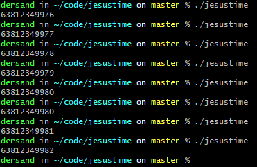

# Jesustime
Have you ever thought about the unix/epoch time and why it doesn't start at the year 0 and not 1970? Well yeah, me neither.

I guess you should look no further. 

This program will print the current jesustime, AKA (`seconds in a year` * `1970`) + `unix/epoch time`.

## Build steps
Requires `make` and `gcc`

`make run`

